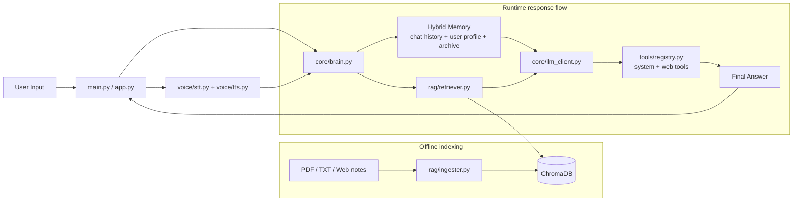

# Jarvis AI Agent

Jarvis is a local-first AI assistant that combines chat, voice, live web search, and document-grounded RAG in one interface. It is built to solve the context-loss problem that happens when a chatbot cannot remember prior conversation, search your files, or answer from live sources without switching tools.

## Description

This project is a personal AI workspace for grounded answers, not just generic chat. It uses hybrid memory plus retrieval over local documents so responses can stay relevant, personalized, and searchable across sessions. It also supports Todoist task actions (add, list, complete) from natural language prompts.

## Tech Stack

| Area | Stack |
| --- | --- |
| Language | Python |
| UI | Streamlit |
| LLM layer | Groq-compatible client, Ollama-compatible fallback |
| RAG | sentence-transformers, ChromaDB, pypdf, tiktoken |
| Memory | JSON chat history, profile memory, persistent Chroma archive |
| Voice | faster-whisper, sounddevice, pyttsx3 |
| Web research | ddgs |
| API layer | FastAPI, Uvicorn (optional / experimental) |
| System tools | psutil |

## What Problem It Solves

Most general-purpose assistants forget what you said a few turns ago, cannot answer from your own documents, and are weak when a task needs both local context and live web information. Jarvis solves that by combining short-term chat memory, long-term vector memory, document retrieval, and tool-based web/system access.

## Architecture

Jarvis follows a two-path architecture: one path indexes knowledge offline, and the other path serves grounded answers at runtime.



## Key Features & Impact

- Hybrid memory keeps recent turns in `memory/chat_history.json`, profile facts in `memory/user_profile.json`, and semantically searchable history in Chroma.
- RAG grounds answers in local documents instead of relying only on model memory, which makes the assistant more useful for private notes and project knowledge.
- Voice mode lets you speak to Jarvis and hear replies back with speech-to-text and text-to-speech support.
- Live web research is available for current events and time-sensitive questions, so the assistant does not depend on stale context alone.
- System tools can expose local machine stats and process information when you explicitly ask for them.
- Todoist task tools let Jarvis add, list, and complete tasks using natural language prompts.

## Quantitative Results

If you have benchmarked Jarvis, keep the table below and replace the placeholder values with your measured results.

| Metric | Score |
| --- | --- |
| Answer grounding accuracy | Add your measured value |
| Retrieval hit rate | Add your measured value |
| Average response latency | Add your measured value |

## How to Run

Use `requirements.txt` for the current dependency set.

```powershell
python -m venv venv
.\venv\Scripts\Activate.ps1
pip install -r requirements.txt
```

Then start either the CLI assistant with `python main.py` or the Streamlit UI with `streamlit run app.py`.

Optional voice mode:

```powershell
python main.py --voice
```

## Common Commands

Use short command-style prompts for best tool routing reliability.

- `list tasks`
- `show my tasks`
- `add task play badminton at 6.00pm`
- `create a task submit report tomorrow 9am`
- `complete task play badminton`

## Configuration

Create a `.env` file in the project root and set the provider and memory paths you want to use.

```env
LLM_PROVIDER=groq
STT_PROVIDER=groq
GROQ_API_KEY=your_groq_api_key_here
GROQ_MODEL=llama-3.1-8b-instant
GROQ_STT_MODEL=whisper-large-v3-turbo
TODOIST_API_KEY=your_todoist_api_token_here
EMBED_MODEL=all-MiniLM-L6-v2
CHAT_MEMORY_PATH=./memory/chat_history.json
USER_PROFILE_PATH=./memory/user_profile.json
CONVERSATION_MEMORY_COLLECTION=conversation_memory
CONVERSATION_MEMORY_RECALL_K=4
MAX_CHAT_HISTORY=10
```

If you already have an old `chroma_db` created with a different embedding model, delete it and reingest your documents so retrieval stays aligned with the current embeddings.

## Demo

Add a short GIF or screenshot of the Streamlit UI here so the project feels production-ready. A good default is `assets/demo.gif` or `assets/dashboard.png` once you capture one.

## Research Note

If you want to link the project to research, cite the retrieval and memory approach you followed here. That is the right place to mention any paper or benchmark that inspired the assistant design.

## Project Overview

- `main.py` starts the CLI assistant.
- `app.py` runs the Streamlit interface.
- `core/` contains the LLM client, brain, and memory stores.
- `rag/` handles document ingestion and retrieval.
- `tools/` contains system and web tools.
- `voice/` contains speech-to-text and text-to-speech support.

## Troubleshooting

- If Groq authentication fails, verify that `GROQ_API_KEY` is set correctly in `.env`.
- If you see `429 Too Many Requests` from Groq, wait briefly and retry, or switch provider by setting `LLM_PROVIDER=ollama`.
- If Todoist task tools fail, verify that `TODOIST_API_KEY` is set in `.env`.
- If speech recognition fails, verify that the microphone is available and the STT provider is set correctly.
- If retrieval looks stale or incorrect, clear `chroma_db` and reingest the source documents.
